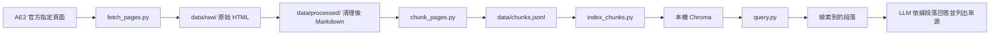

# Minecraft AE2 RAG Assistant

> 針對 Minecraft 1.21.1 與 Applied Energistics 2（AE2）的知識問答 RAG 助手。

---

## 1. 專案簡介

本專案建立一個 **RAG（Retrieval-Augmented Generation）問答助手**，目標是回答關於 Minecraft 1.21.1 與 Applied Energistics 2（AE2）的知識問題，涵蓋概念說明、使用流程與自動合成等主題。

設計原則：

- **第一版只以 AE2 官方 1.21.1 線上指南作為資料來源**，不宣稱能查核特定模組包的客製配方。
- 所有回答皆以**官方文件**為依據，並於每個答案附上可點擊的來源連結。
- 當官方文件資料不足時，系統**必須明確表示無法確認**，不得補完或猜測。

---

## 2. MVP 範圍

**MVP（Minimum Viable Product，最小可行產品）** 僅涵蓋下列範圍：

- **資料來源**：AE2 官方 1.21.1 Guide。
- **頁面數量**：初期僅處理人工指定的 15～20 個官方頁面，**不進行全站自動爬取**。
- **功能流程**：文件擷取 → Markdown 清理 → chunking → embedding → Chroma 檢索 → 附來源回答。

**不在 MVP 範圍內**：

- Minecraft 模組包 JAR 解析
- KubeJS／CraftTweaker 覆寫解析
- 多模組支援
- 帳號系統
- 雲端部署
- 多 Agent

---

## 3. 預定技術棧

本專案規劃使用的技術如下：

| 用途 | 技術 |
| --- | --- |
| 語言 | Python |
| 網頁下載與擷取 | `requests` + BeautifulSoup |
| 中間文件格式 | Markdown + YAML metadata |
| 本機向量資料庫 | Chroma |
| 向量化 | OpenAI Embeddings |
| 回答生成 | OpenAI LLM（僅依據檢索內容生成） |
| 展示介面 | Streamlit（最後階段） |

**重要決定**：初期**不使用 LangChain**，先理解底層資料流程，再依需要引入較高層級的抽象。

---

## 4. 資料流程

使用 Mermaid 流程圖說明整體資料流向：



文字說明：

1. **擷取**：`fetch_pages.py` 下載 AE2 官方指定網頁，儲存原始 HTML 至 `data/raw/`。
2. **清理**：移除雜訊並轉為 Markdown，儲存至 `data/processed/`。
3. **切分**：`chunk_pages.py` 將 Markdown 切成 chunks，輸出至 `data/chunks.jsonl`。
4. **索引**：`index_chunks.py` 計算 embedding 並寫入本機 Chroma。
5. **檢索與回答**：`query.py` 依使用者問題檢索最相關段落，交由 LLM 依據段落回答並列出來源。

---

## 5. 預定目錄結構

```text
Minecraft_RAG/
├── README.md
├── fetch_pages.py      # 已存在（尚未實作）
├── chunk_pages.py      # 尚未建立（預定）
├── index_chunks.py     # 尚未建立（預定）
├── query.py            # 尚未建立（預定）
├── app.py              # 尚未建立（預定）
├── requirements.txt    # 尚未建立（預定）
├── .env.example        # 尚未建立（預定）
├── data/
│   ├── raw/            # 尚未建立（預定）
│   ├── processed/      # 尚未建立（預定）
│   └── chunks.jsonl    # 尚未建立（預定）
└── tests/              # 尚未建立（預定）
```

> 標註說明：目前實際存在的僅有 `README.md` 與 `fetch_pages.py`（尚未實作）。其餘檔案與資料夾皆為後續才會建立的預定專案。

---

## 6. 文件與 chunk 規範

- 每份 Markdown 必須帶有 YAML metadata，包含以下欄位：
  - `title`
  - `source_url`
  - `minecraft_version`
  - `mod`
  - `source_type`
  - `fetched_at`
- 固定使用以下數值：
  - `minecraft_version: "1.21.1"`
  - `mod: "Applied Energistics 2"`
- 以 **Markdown 標題優先切分**。
- chunk 長度約 **500～700 tokens**，重疊約 **80～120 tokens**。
- 每個 chunk 必須保留：頁面 URL、頁名、章節標題與版本資訊。
- **不可將沒有來源 URL 的文字納入正式知識庫。**

---

## 7. 回答品質與 RAG 規範

- LLM **只能依據檢索到的 chunk 作答**，不得使用檢索範圍外的知識補字。
- 每個答案需附**可點擊的來源網址**。
- 當資訊不足時，回答 **「目前官方文件不足以確認」**，不得補完或猜測。
- **不可混用非 1.21.1 版本的 AE2 文件。**
- 除錯時**先檢索品質、再調整 chunking**；不要因為答案錯誤就直接換模型。

---

## 8. 開發里程碑

| Phase | 目標 |
| --- | --- |
| **Phase 1** | 指定 3 個官方頁面，產出並人工驗證乾淨 Markdown。 |
| **Phase 2** | 擴增到 15～20 頁，切成 chunks 並建立 Chroma 索引。 |
| **Phase 3** | 用 5 個固定問題驗證 Top 3 檢索結果。 |
| **Phase 4** | 串接 LLM，生成附來源的回答。 |
| **Phase 5** | 建立 Streamlit demo。 |
| **Phase 6（非 MVP）** | 加入本地 modpack 配方解析，並以 SQLite 做精確配方查詢。 |

---

## 9. 初始驗收問題

下列問題作為 Phase 3 與 Phase 4 的驗收依據：

1. 最基本的 AE2 儲存系統如何建立？
2. Inscriber 的用途是什麼？
3. Crafting Pattern 與 Processing Pattern 有什麼差別？
4. 建立自動合成最少需要哪些方塊？
5. ME 網路為什麼沒有電？

---

## 10. 給 AI 協作者的工作規範

- 每次修改前先閱讀 README 與現有檔案。
- 保持每個程式檔案**職責單一**。
- 先建立**可執行的最小版本**，再擴充功能。
- 新增依賴前必須在 README 說明用途。
- **不得在程式碼中寫入 API Key**；只從 `.env` 讀取。
- 所有可重複產生的資料都不得提交敏感資訊。
- 所有資料處理步驟應**可重複執行**。
- 重要函式應有**型別標註**與清楚的錯誤訊息。
- 程式完成後，應提供**可執行的驗證方式**。
- **程式碼模組化**：構築程式時盡量將程式碼拆成模組化結構；除非有需要，否則**禁止大範圍重構**。
- 應**盡可能遵循既有程式碼風格**，保持一致性。