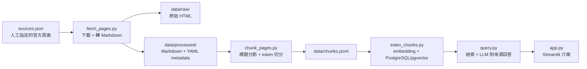

# Minecraft AE2 RAG Assistant

針對 Minecraft 1.21.1 與 Applied Energistics 2（AE2）的知識問答 RAG 助手：只依據 AE2 官方 1.21.1 指南回答問題，每個答案附可點擊的來源連結；官方文件不足以回答時，明確回覆「無法確認」，不猜測、不補完。

## 專案目的

AE2 的玩法知識（ME 儲存、頻道、能源、自動合成等）散落在官方指南的數十個頁面中，查詢成本高。本專案將指定頁面整理成可檢索的知識庫，以檢索增強生成（RAG）提供有據可查的問答服務。

三條核心原則：

1. **來源限定**——只使用 `guide.appliedenergistics.org` 的 1.21.1 官方頁面，不混用其他版本或非官方資料。
2. **答案附來源**——每個回答標註出自哪個頁面與章節。
3. **不足則明說**——檢索不到依據時承認無法確認。

## 整體架構

資料以單向管線流動：每個階段讀取上游檔案、寫入自己的產物，可獨立重跑。



已實作：`fetch_pages.py`、`chunk_pages.py` 與資料產物；索引、查詢、介面為後續階段。

## 目錄結構

```text
Minecraft_RAG/
├── README.md            # 專案架構與使用說明（人類讀者）
├── AGENTS.md            # AI Agent 的專案架構基準
├── analysis-summary.md  # 專案總結分析（2026-09-13）
├── sources.json         # 官方頁面來源清單（知識庫唯一入口）
├── fetch_pages.py       # 擷取：下載頁面、HTML → Markdown
├── chunk_pages.py       # 切分：標題分節、token 切分
├── requirements.txt     # Python 依賴（requests、beautifulsoup4）
├── index_chunks.py      # （未建立）embedding + PostgreSQL/pgvector
├── query.py             # （未建立）檢索 + LLM 附來源回答
├── app.py               # （未建立）Streamlit 介面
├── data/
│   ├── raw/             # 原始 HTML：<host>/<slug>.html
│   ├── processed/       # 清理後 Markdown：<host>/<slug>.md（含 YAML metadata）
│   ├── chunks.jsonl     # 切分產物（32 chunks）
│   └── embeddings.jsonl # embedding 向量（尚未產生）
├── skills/              # Codex 版 skill：project-limit、dev-environment
└── .agents/skills/      # ZCode 版 skill：共 5 個（含 git-* 三個）
```

`recall.md`、`read.md` 為本機協作文件，不入版控。

## 主要模組與職責

| 模組 | 狀態 | 職責 |
| --- | --- | --- |
| `sources.json` | ✅ | 唯一的抓取入口：人工指定的官方頁面清單（目前 6 頁） |
| `fetch_pages.py` | ✅ | 逐頁下載（網域白名單）→ 保存原始 HTML → 擷取主文轉 Markdown → 寫入 YAML metadata |
| `chunk_pages.py` | ✅ | 解析 metadata → 依標題分節 → 依 token 目標切分（含重疊）→ 輸出 `data/chunks.jsonl` |
| `embed_chunks.py` | ✅ 已建立（尚未執行） | 讀取 `chunks.jsonl`，以 all-MiniLM-L6-v2 產生正規化 embedding 向量（保留原始 metadata） |
| `index_chunks.py` | 未建立 | 讀取 embedding 向量與 metadata，寫入 PostgreSQL + pgvector |
| `query.py` | 未建立 | 依問題檢索 Top-K 段落，LLM 僅依檢索內容作答並附來源 |
| `app.py` | 未建立 | Streamlit 問答介面 |

## 模組之間的關係

- **單向依賴**：下游只消費上游的檔案產物，不回頭修改；任一階段可單獨重跑，產物冪等（整份覆寫重產生）。
- **metadata 貫穿全鏈**：每頁的標題、來源 URL、版本資訊由 fetch 寫入、chunk 繼承到每個段落，最終供 query 產生來源連結。
- **知識庫單一入口**：只有 `sources.json` 指定的頁面會進入知識庫；缺來源 URL 的內容會被 chunk 階段拒絕。

## 使用與開發

```bash
pip install -r requirements.txt   # requests、beautifulsoup4、sentence-transformers
python fetch_pages.py             # 下載並轉檔 sources.json 中的頁面
python chunk_pages.py             # 產生 data/chunks.jsonl
python embed_chunks.py            # 產生 data/embeddings.jsonl（程式已備妥、尚未執行）
```

- 執行環境：Python 3.9 以上。
- **新增知識來源**：編輯 `sources.json`（URL 必須屬於官方指南網域），重跑上述兩步。
- **調整切分粒度**：`chunk_pages.py` 頂部常數——`TARGET_TOKENS`（600）、`OVERLAP_TOKENS`（100）、`MIN_CHUNK_TOKENS`（40）。
- **Embedding**：指定模型 `sentence-transformers/all-MiniLM-L6-v2`（本機執行，不需要 API key）；首次執行 `embed_chunks.py` 時才會自 Hugging Face 下載模型。
- **金鑰管理**：LLM 的 API key 一律透過 `.env` 讀取，不得寫入程式碼或版控（retrieval 實作時導入）。

## 開發里程碑

| Phase | 目標 | 狀態 |
| --- | --- | --- |
| 1 | 產出並人工驗證乾淨 Markdown | ✅ 完成（6 頁） |
| 2 | 擴增至 15～20 頁、切 chunks、建 pgvector 索引 | ◐ chunks 已完成並通過品質檢查（32 個）；embedding 程式已備妥（未執行）；索引未開始 |
| 3 | 以 5 個固定問題驗證 Top 3 檢索 | 未開始 |
| 4 | 串接 LLM 生成附來源回答 | 未開始 |
| 5 | Streamlit demo | 未開始 |
| 6 | modpack 配方解析（SQLite） | 非 MVP |

### 目前階段狀態

```text
Chunking: completed
Chunk QA: completed
Embedding model: configured（sentence-transformers/all-MiniLM-L6-v2）
Embedding program: prepared（embed_chunks.py）
Embedding execution: NOT RUN
Vector index: NOT CREATED（目標：PostgreSQL + pgvector）
Retrieval evaluation: NOT STARTED
```

### Embedding 設定與 PostgreSQL（pgvector）相容性準備

- **Model**：`sentence-transformers/all-MiniLM-L6-v2`（configured，尚未下載）
- **Embedding dimension**：384（依模型文件；UNKNOWN — REQUIRES RUNTIME VERIFICATION）
- **Distance metric**：待決策（向量已正規化，建議 cosine）
- **Vector column**：未來使用 pgvector 的 `vector` 型別（尚未建立）
- **Embedding input**：`section_title` + `page_title` + `content`；`source_url`／`fetched_at`／`chunk_id` 保留為 metadata／provenance 欄位，不進入 embedding 文字
- **Stable identifier**：`source_url` + `chunk_id` 複合鍵（`chunk_id` 為頁內編號，非全域唯一）；是否改用穩定 UUID 待 index 階段決策
- **Model cache**：Hugging Face 預設快取目錄（UNKNOWN — REQUIRES RUNTIME VERIFICATION）
- **Truncation**：模型 max_seq_length 為 256 wordpieces，超長 chunk 會截斷（實際影響 UNKNOWN — REQUIRES RUNTIME VERIFICATION）

Phase 3–4 的驗收問題：最基本的 AE2 儲存系統如何建立？Inscriber 的用途是什麼？Crafting Pattern 與 Processing Pattern 有什麼差別？建立自動合成最少需要哪些方塊？ME 網路為什麼沒有電？
