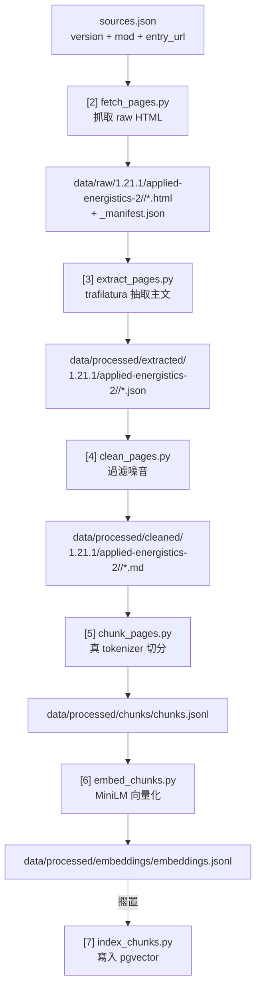

# Minecraft AE2 RAG Assistant

針對 Minecraft 1.21.1 與 Applied Energistics 2（AE2）的知識問答 RAG 助手：只依據 AE2 官方 1.21.1 指南回答問題，每個答案附可點擊的來源連結；官方文件不足以回答時，明確回覆「無法確認」，不猜測、不補完。

本專案同時是**學習成熟 RAG 技術棧**的練習：pipeline 各階段採用業界常見工具（trafilatura、langchain-text-splitters、sentence-transformers、pgvector），而非只求最短交付路徑。

## 三條核心原則

1. **來源限定**——只使用 `guide.appliedenergistics.org` 的 1.21.1 官方頁面，不混用其他版本或非官方資料。
2. **答案附來源**——每個回答標註出自哪個頁面與章節。
3. **不足則明說**——檢索不到依據時承認無法確認。

## 整體架構

資料以單向管線流動，分為七個階段；每個階段讀取上游產物、寫入自己的輸出，可獨立重跑，所有中間產物為**單次記錄、覆蓋更新**（不做 history）。


```mermaid
flowchart TD
    S["sources.json<br>version + mod + entry_url"] --> F["[2] fetch_pages.py<br>抓取 raw HTML"]
    F --> RAW["data/raw/1.21.1/applied-energistics-2/<chapter>/*.html<br>+ _manifest.json"]
    RAW --> E["[3] extract_pages.py<br>trafilatura 抽取主文"]
    E --> EXT["data/processed/extracted/<br>1.21.1/applied-energistics-2/<chapter>/*.json"]
    EXT --> C["[4] clean_pages.py<br>過濾噪音"]
    C --> CLN["data/processed/cleaned/<br>1.21.1/applied-energistics-2/<chapter>/*.md"]
    CLN --> K["[5] chunk_pages.py<br>真 tokenizer 切分"]
    K --> CHK["data/processed/chunks/chunks.jsonl"]
    CHK --> M["[6] embed_chunks.py<br>MiniLM 向量化"]
    M --> EMB["data/processed/embeddings/embeddings.jsonl"]
    EMB -.擱置.-> I["[7] index_chunks.py<br>寫入 pgvector"]
```

**[7] 目前擱置**——schema、入庫方式與索引類型待 [1]–[6] 跑通後依實際資料定義。

> 各階段的完整定義（職責、參數、schema、失敗處理）見 [`ARCHITECTURE.md`](ARCHITECTURE.md)。

## 目錄結構

```text
Minecraft_RAG/
├── sources.json                      # [1] 入口 URL + 版本 + 模組
├── data/
│   ├── raw/                          # [2] 抓取
│   │   ├── _manifest.json            #     單次抓取記錄（覆蓋）
│   │   └── 1.21.1/applied-energistics-2/<chapter>/*.html
│   ├── processed/
│   │   ├── extracted/1.21.1/applied-energistics-2/<chapter>/*.json   # [3] trafilatura 抽取
│   │   ├── cleaned/1.21.1/applied-energistics-2/<chapter>/*.md       # [4] 清理後 Markdown
│   │   ├── chunks/chunks.jsonl           # [5] 切分
│   │   └── embeddings/embeddings.jsonl   # [6] 向量
│   └── evaluation/                   # 評估（未來範圍，不屬 [1]–[7]）
├── reports/
│   ├── extraction_report.md          # [3] 單次報告（覆蓋）
│   └── cleaning_report.md            # [4] 單次報告（覆蓋）
├── src/
│   ├── fetch_pages.py                # [2] 抓取
│   ├── extract_pages.py              # [3] 抽取
│   ├── clean_pages.py                # [4] 清理
│   ├── chunk_pages.py                # [5] 切分
│   ├── embed_chunks.py               # [6] Embedding
│   └── index_chunks.py               # [7] 入庫（擱置）
├── ARCHITECTURE.md                   # 目標架構（[1]–[7]）
├── AGENTS.md                         # AI Agent 工程契約
├── pyproject.toml / requirements.txt # 專案 metadata 與依賴
├── .env.example                      # 環境變數範本（query 階段用）
└── .gitignore
```

資料產物一律按 `<version>/<mod_slug>/<chapter>/` 分層。`mod_slug`、`chapter`、`page_slug` 都由 [2] 從 URL 解析後寫入路徑，下游階段直接從路徑讀，不需查 JSON。沒有 chapter 的頁（如 `getting-started`）歸入 `other/`。

## 各階段說明

| 階段 | 模組 | 職責 |
| --- | --- | --- |
| [1] 入口 | `sources.json` | `version` + `mod`（原名）+ `entry_url`；入口頁**只作導航來源，不抓取**，範圍由其側邊欄所有連結決定；`sources.json` 為整條 URL 鏈的起點 |
| [2] 抓取 | `src/fetch_pages.py` | 只做網路 I/O；BeautifulSoup 解析側邊欄導覽取得子頁面 URL；逐頁抓取、間隔 0.5 秒；`mod` 經 python-slugify 轉 `mod_slug`，`chapter`／`page_slug` 由 URL 解析寫入路徑；輸出 raw HTML 與 `_manifest.json` |
| [3] 抽取 | `src/extract_pages.py` | trafilatura 從 raw HTML 抽取主文；輸出含 `title`／`text`／`source`／`hostname`／`http_status` 的 JSON（`title` 保留不異動）；報告標示 `source` 為空的頁 |
| [4] 清理 | `src/clean_pages.py` | 過濾 trafilatura 誤留的噪音，輸出含 frontmatter（至少 `title`、`source_url`）與 `# <title>` 的 Markdown；**噪音規則待第一波資料後歸納** |
| [5] 切分 | `src/chunk_pages.py` | **只讀 cleaned MD**（`title`／`source_url` 從 frontmatter 讀，其餘 metadata 從路徑讀）；MarkdownHeaderTextSplitter + RecursiveCharacterTextSplitter；MiniLM **真 tokenizer**；每 chunk ≤ 254 wordpieces |
| [6] Embedding | `src/embed_chunks.py` | all-MiniLM-L6-v2（384 維、正規化、**revision 鎖定**）；輸入拼接 `{mod} \| {page} \| {section}\n\n{text}` |
| [7] 入庫 | `src/index_chunks.py` | 寫入 pgvector；**擱置**，schema 待資料準備後定義 |

### 各階段套件

> 本表為速查，給人閱讀；正式契約見 [`ARCHITECTURE.md`](ARCHITECTURE.md)。

| 階段 | 套件 | 職責 | 不負責 |
| --- | --- | --- | --- |
| [1] 入口 | 無（靜態設定） | `sources.json` 定義入口與版本 | 不含逐頁 URL 清單（由 [2] 解析導覽產生） |
| [2] 抓取 | requests + BeautifulSoup + python-slugify | 網路 I/O；解析側邊欄導覽取得逐頁 URL；`mod` → `mod_slug` | HTML→Markdown 轉換、主文抽取 |
| [3] 抽取 | trafilatura | 抽取主文與 metadata（`title`／`text`／`source`／`hostname`） | HTML 手工解析、清理 |
| [4] 清理 | 本專案自寫規則 | 過濾 trafilatura 誤留的噪音 | 規則待第一波資料後歸納 |
| [5] 切分 | MarkdownHeaderTextSplitter + RecursiveCharacterTextSplitter | 依標題層級與字元邊界切分；MiniLM 真 tokenizer 計數 | — |
| [6] Embedding | sentence-transformers（MiniLM） | 向量化（正規化、revision 鎖定） | — |
| [7] 入庫 | pgvector | 寫入向量庫（**擱置**，schema 待定） | — |

本專案手寫的只有 [2] 的導覽解析邏輯、[4] 的噪音清理規則、各階段的檔案 I/O 與路徑組合；HTML 解析、主文抽取、切分皆交給成熟套件。

### [5] 切分參數

- `chunk_size`：200 token
- `chunk_overlap`：40–50 token
- tokenizer：MiniLM 真實 tokenizer（非字元近似）
- **切分後斷言**：每個 chunk ≤ 254 wordpieces（模型 `max_seq_length` 256，保留 2 wordpieces 餘裕）

### chunk_id 格式

```
{mod_slug}_{page_slug}_{seq}_{version}
```

例如 `applied-energistics-2_energy_0001_v1`。`seq` 以頁為單位，同一頁的 chunk 從 `0001` 開始遞增；結尾的 `v1` 是**內容修訂號**——該 chunk 內容需要更新時迭代為 `v2`、`v3`。

> `mod_slug`／`chapter`／`page_slug` 全部由 [2] 從 URL 解析後寫入目錄路徑，[5] 直接從路徑讀（`mod_slug`、`chapter` 從資料夾名，`page_slug` 從檔名），不需讀任何 JSON。

## 使用方式

### 安裝

建議以虛擬環境安裝（Python 3.12）：

```bash
python -m venv .venv
.venv\Scripts\activate          # Windows
```

**有 NVIDIA GPU 時**，Windows 上 PyPI 的 `torch` 是 CPU-only build，須先從 PyTorch 的 cu130 index 手動裝 GPU 版，再裝其餘依賴（torch 是 sentence-transformers 的傳遞依賴，不寫進 `requirements.txt`）：

```bash
pip install torch==2.14.0 --index-url https://download.pytorch.org/whl/cu130
pip install -r requirements.txt
```

無 GPU 或不需要 GPU 加速時，直接裝即可：

```bash
pip install -r requirements.txt
```

主要依賴：requests、beautifulsoup4、trafilatura、langchain-text-splitters、python-slugify、sentence-transformers。

### 執行 pipeline

```bash
python src/fetch_pages.py     # [2] 抓入口側邊欄所有頁面 → data/raw/
python src/extract_pages.py   # [3] trafilatura 抽取主文 → data/processed/extracted/
python src/clean_pages.py     # [4] 清理 → data/processed/cleaned/
python src/chunk_pages.py     # [5] 切分 → data/processed/chunks/chunks.jsonl
python src/embed_chunks.py    # [6] 向量化 → data/processed/embeddings/embeddings.jsonl
```

每個階段都可單獨重跑，輸出為**整份覆寫**（冪等）。[2] 失敗的頁面不會重試，會記錄在 `_manifest.json` 的 `http_status` 與 `local_path: null`，人工查驗後再次執行即可。

- 執行環境：Python 3.12 以上。
- Embedding 模型為本機執行，首次跑 [6] 時才會自 Hugging Face 下載（約 90 MB）。
- **[7] 入庫暫不執行**：pgvector 的 schema、入庫方式與索引類型待 [1]–[6] 跑通後定義。

### 常見操作

- **改變抓取範圍**：編輯 `sources.json` 的 `exclude`／`include`，或更換 `entry_url`；入口頁本身不會進入知識庫。
- **調整切分粒度**：`src/chunk_pages.py` 的 `chunk_size`／`chunk_overlap`；調整後 [6] 必須重跑。
- **金鑰管理**：LLM 的 API key 一律透過 `.env` 讀取（範本見 `.env.example`），不得寫入程式碼或版控。

## 設計決策

| 決策 | 理由 |
| --- | --- |
| 廢棄舊 `sources.json`（6 頁人工清單） | 改為「入口 URL + 版本 + 模組」，範圍由側邊欄導覽決定，不再逐頁人工維護 |
| 抓取與抽取分離 | `fetch_pages.py` 只做網路 I/O；HTML 主文抽取交給 trafilatura，避免自寫轉換器的維護成本 |
| 目錄按 `<version>/<mod_slug>/<chapter>/` 分 | 版本、模組與章節隨資料一路傳遞；metadata 由路徑承載，下游不需讀 JSON |
| 路徑三元素由 [2] 統一解析 | `mod_slug`（slugify）／`chapter`（URL 倒數第二段）／`page_slug`（URL 最後一段）只在 [2] 計算一次，其餘階段全部從路徑讀，不重複推導 |
| `title` 帶進 chunk metadata | extracted JSON 的標題原封傳到 chunk，生成答案直接用 chunk 的 `title`，不回查 JSON（資料不異動） |
| cleaned MD 保留 frontmatter 與 H1 | frontmatter 承載 `title`／`source_url` 供 [5] 讀 metadata；H1 供 MarkdownHeaderTextSplitter 當切分結構，兩者各按各的邏輯索取 |
| 單次記錄、覆蓋更新 | 所有中間產物不做 history，重跑即重產生 |
| `chunk_id` 含修訂號 | chunk 內容更新時可迭代版本號，區隔新舊內容 |
| embedding 輸入拼接標題 | `{mod} \| {page} \| {section}\n\n{text}`，讓向量帶有頁面與章節語意 |
| pgvector 選型 | 已確認合理；schema 待資料準備後定義 |

## 開發狀態

| 階段 | 狀態 |
| --- | --- |
| [1] 入口 | `sources.json` 已套用新格式（`version`／`mod`／`entry_url`／`exclude`／`include`） |
| [2] 抓取 | 待依新架構實作（舊版含 HTML→MD 轉換，已不符合新職責） |
| [3] 抽取 | 待實作（trafilatura） |
| [4] 清理 | 待實作；噪音規則待第一波資料後歸納 |
| [5] 切分 | 待實作（改用 langchain-text-splitters + 真 tokenizer） |
| [6] Embedding | 待依新 schema 實作（revision 鎖定 + 新輸入格式） |
| [7] 入庫 | **擱置**，schema 待 [1]–[6] 跑通後定義 |

> 本表反映的是**目標狀態下的實作進度**，與實際程式碼狀態以 Git 與檔案為準。

## 安全須知

- `.env`、`gcm-diagnose.log`（含歷史診斷輸出）等敏感檔案已列入 `.gitignore`，不會進入版控；**請勿直接壓縮分享整個專案資料夾**，改以 Git clone 或明確挑選檔案，避免本機未追蹤的敏感檔案一併外洩。
- 若曾在本機產生含 API key 的診斷檔，該 key 應視為已外洩並至 provider 端輪換。
